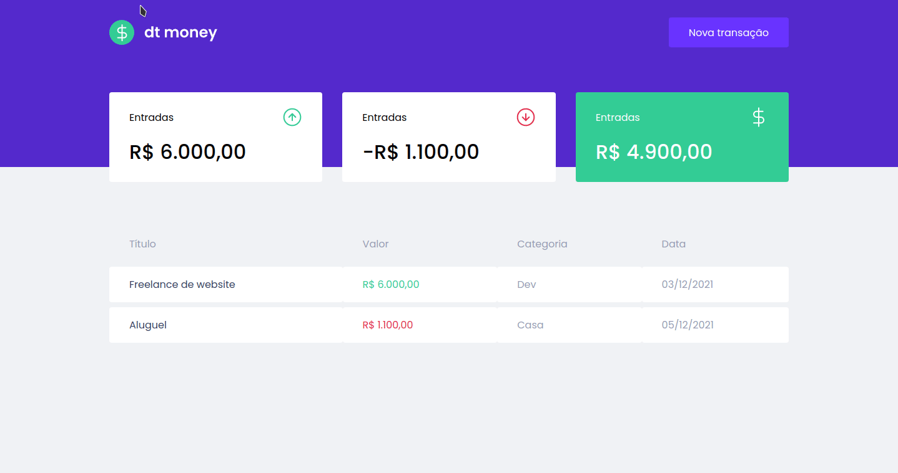
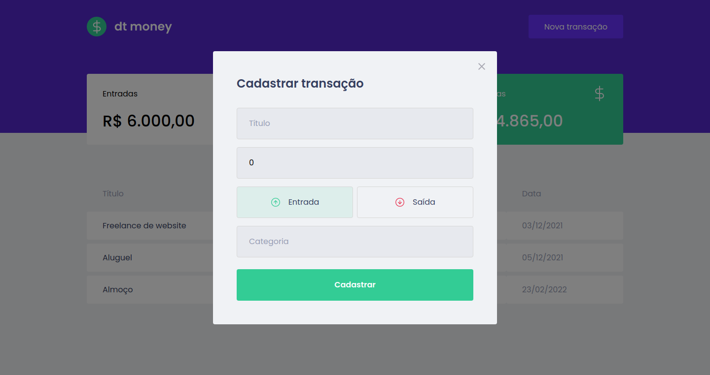

# dtmoney

<p align="center">
  
</p>

<h2 align="center">
  A simple finance tracker app. Built with ReactJS, Styled Components, MirageJS 
  and Typescript.
</h2>

<p align="center">
  

  

  <a href="https://github.com/areasflavio/dtmoney/commits/master">
    
  </a>
</p>

<p align="center">
  <a href="#star-features">Features</a>&nbsp;&nbsp;|&nbsp;&nbsp;
  <a href="#keyboard-technologies">Technologies</a>&nbsp;&nbsp;|&nbsp;&nbsp;
  <a href="#computer_mouse-installation">Installation</a>
</p>





<br/>

# :star: Features

[(Back to top)](#dtmoney)

This is a simple finance tracker app. You can start tracking your finances right away.

Some key features are:

- Functional application with ReactJS.
- UI built with Styled Components.
- Cards that resume the income, outcome and the final balance.
- Table that displays all transactions.
- Intuitive new transaction form.

The application is built using ReactJS. Data is provided by a API build using
MirageJS. The user interface is built with Styled Components. The entire codebase
is written using Typescript.

<br/>

# :keyboard: Technologies

[(Back to top)](#dtmoney)

This is what I used and learned with this project:

- [x] ReactJS
- [x] Styled Components
- [x] React Modal
- [x] Polished
- [x] MirageJS
- [x] Axios
- [x] Typescript

<br/>

# :computer_mouse: Installation

[(Back to top)](#dtmoney)

To use this project, first you need NodeJS and the API running in your device,
then you can follow the commands below:

```bash
# Clone this repository
git clone https://github.com/areasflavio/dtmoney.git

# Go into the repository
cd dtmoney

# Install dependencies for the application
yarn install

# To start the development server, run the following command
yarn start
```

# :man_technologist: Author

[(Back to top)](#dtmoney)

Build by Flávio Arêas 👋 [Get in touch!](https://www.linkedin.com/in/areasflavio/)
